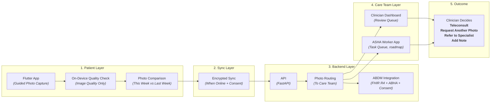

# StepGuard AI — Weekly Foot Check Companion

> **Helping people with diabetes stay connected to their care team — one weekly photo at a time.**

StepGuard is a **care coordination and communication tool** for diabetic foot health. It helps patients (or ASHA workers on their behalf) capture a weekly foot photo, shares it securely with the patient's care team through ABDM with the patient's consent, and keeps the clinician in control of every decision.

**StepGuard does NOT diagnose, score risk, interpret images, recommend treatment, or provide clinical advice.** It is an assistive coordination tool. Every clinical decision is made by a licensed clinician.

[](LICENSE)
[](https://flutter.dev)
[](https://nextjs.org)
[](https://fastapi.tiangolo.com)
[](docs/regulatory/abdm-integration.md)

---

## Project Status

This project was created for a health hackathon. Status is stated plainly so nothing is overclaimed.

| Component | Status |
|---|---|
| Architecture, scope and care-coordination design | Done |
| Guided capture + image-quality check | Prototype in progress |
| Week-over-week photo comparison | Prototype in progress |
| Clinician review dashboard (4 actions) | Prototype in progress |
| ABDM consent flow + FHIR R4 mapping | Designed; mocked for demo, sandbox integration planned |
| ASHA worker app | Roadmap |
| Teleconsult (eSanjeevani) link-out | Roadmap |
| Production infrastructure (Kubernetes, monitoring) | Roadmap |

*(Screenshots / demo video: add here.)*

---

## The Problem

Diabetic foot ulcers are a leading precursor to lower-limb amputation, and many are preventable when problems are noticed early. Yet the current care model depends on two things that rarely happen: patients checking their feet regularly, and clinicians seeing them often enough to notice changes.

**Why patients struggle to check their feet**

- **Neuropathy reduces sensation.** Many patients cannot feel small injuries, blisters or pressure points.
- **Vision and mobility barriers.** Elderly patients, or those with visual impairment or limited mobility, often cannot inspect the soles of their feet.
- **Care fatigue.** Managing diabetes already demands constant effort; daily foot exams add to it.

**Why the health system struggles**

- **Episodic care is infrequent.** Patients typically see a doctor every 3–6 months, while changes can develop within weeks.
- **Rural access gap.** Specialist foot care is concentrated in cities, so frequent visits are costly and impractical for rural patients.
- **Scale.** Studies in Indian diabetes clinics report that a large share of attendees are at risk of foot complications and a notable minority already have an ulcer (see [References](#references)).

**The gap is not clinical knowledge. It is communication, continuity and coordination** between patients, ASHA workers and clinicians between visits.

---

## The Solution

StepGuard is a **weekly foot check companion** built from four assistive components:

1. **Guided Photo Capture** — The app helps patients or ASHA workers capture a consistent weekly foot photo with an outline overlay and lighting/framing guidance.
2. **Image Quality Check** — On-device checks confirm only that the photo is usable (sharp, well lit, fully in frame). No clinical analysis is performed.
3. **Week-over-Week Comparison** — The patient sees this week's photo beside last week's, as a visual reference only.
4. **Secure Sharing via ABDM** — With the patient's consent, photos are shared with the care team through ABDM's consent framework. Clinicians review and decide what happens next.

**Every clinical decision — schedule a teleconsult, request another photo, refer to a specialist, or add a note — is made by a clinician.** StepGuard only organises information and helps people communicate.

### Supporting context

- A randomised controlled trial in rural Australia found no statistically significant difference in wound healing or amputation rates between nurse-led telemedicine and usual podiatrist care over 12 weeks. This supports remote follow-up with clinician-led escalation.
- ASHA workers in several Indian states have been trained in diabetic foot screening through World Diabetes Foundation–supported programs, showing a workforce already exists for community-level foot care.
- ABDM provides ABHA identity, FHIR R4 data exchange and a consent framework that StepGuard is designed to build on.

---

## System Architecture



---

## How Each Part Works

### 1. Patient Layer
- **Flutter app** — Guided camera capture (foot outline overlay, lighting check, framing guidance). Designed for Hindi and English, with regional languages planned.
- **On-device quality check** — OpenCV-based checks for sharpness, brightness and framing only.
- **Photo comparison** — Side-by-side view of the current and previous photo. This is not a clinical interpretation.

### 2. Sync Layer
The app is **offline-first**, since rural connectivity is intermittent.
- Photos are stored in encrypted local storage until the patient consents to share.
- When connectivity returns and consent is given, photos sync over HTTPS.
- Patients choose what to share. Nothing is shared without consent.

### 3. Backend Layer
- **API** — FastAPI service handling authentication, ingestion and routing.
- **Photo routing** — Sends photos to the clinician in the patient's registered care team.
- **ABDM integration** — Packages photos as FHIR R4 resources for exchange, using ABHA identity and ABDM consent artifacts.

### 4. Care Team Layer
- **Clinician dashboard** (Next.js) — Review queue showing the current photo, previous photo and history, with four actions: **Schedule teleconsult / Request another photo / Refer to specialist / Add note**.
- **ASHA worker app** (Flutter, roadmap) — Task list of patients due for a weekly photo, with assisted capture.

### 5. Outcome Metrics
Success will be measured by engagement and responsiveness, not by any clinical prediction:
- % of weekly photos captured
- % of photos reviewed by a clinician within 48 hours
- % of reviewed cases where the clinician arranged a follow-up
- Time to clinician review compared with routine-visit baseline
- Patient-reported satisfaction

---

## What's Novel Here

StepGuard builds on established foundations: telemedicine for diabetic foot care, community ASHA programs, ABDM infrastructure, and standard guided-capture UI patterns.

**Our contribution** is combining these into one coordination workflow that:
1. Makes weekly foot photos easy for patients or ASHA workers to capture.
2. Shares them with the care team using ABDM's consent framework.
3. Keeps the clinician in control of every clinical decision.
4. Works offline-first for rural India.

To our knowledge, few open-source projects combine these four elements.

---

## Tech Stack (planned and in use)

| Layer | Technology |
|---|---|
| Mobile app | Flutter (Dart) |
| Clinician portal | Next.js + React + TypeScript, Tailwind CSS |
| On-device quality check | OpenCV |
| Local storage | Encrypted SQLite |
| Backend | FastAPI (Python), SQLAlchemy, Pydantic |
| Database | PostgreSQL |
| Photo storage | S3 / MinIO (encrypted) |
| Health data standard | HL7 FHIR R4 |
| National health stack | ABHA, ABDM consent manager (sandbox) |
| Telemedicine (roadmap) | eSanjeevani link-out |
| CI/CD and packaging | GitHub Actions, Docker |

---

## Repository Structure

The repository is organised around the target architecture; see [Project Status](#project-status) for what is implemented.

```
.
├── apps/             → patient app, ASHA app (roadmap), clinician portal
├── services/         → backend services (photo, patient, FHIR conversion, ...)
├── integrations/     → ABDM, eSanjeevani (roadmap)
├── infrastructure/   → Docker and deployment configuration
├── shared/           → shared libraries
├── docs/             → architecture, regulatory notes, user guides
├── tests/            → unit, integration, e2e
└── README.md
```

---

## Setup

> Setup commands target the intended structure. Components marked as roadmap above are not yet runnable.

```bash
git clone https://github.com/kamblepranjali88-code/StepGuard-AI---Weekly-Foot-Check-Companion.git
cd StepGuard-AI---Weekly-Foot-Check-Companion
cp .env.example .env

# Backend
python -m venv .venv
source .venv/bin/activate        # Windows: .venv\Scripts\activate
pip install -r requirements.txt

# Infrastructure
docker-compose up -d

# Clinician portal
cd apps/clinician-portal && npm install && npm run dev

# Patient app
cd apps/patient-app && flutter pub get && flutter run
```

---

## Privacy, Consent and Compliance

StepGuard is designed as an **assistive care coordination tool**, not a diagnostic device.

| Area | Position |
|---|---|
| Consent | Photos are shared only after explicit patient consent; patients can choose which photos to share |
| Data minimisation | Only what the care team needs is shared |
| DPDP Act 2023 | Designed around consent and data minimisation; formal compliance review pending |
| ABDM | ABHA, consent and FHIR R4 flow designed; sandbox integration planned |
| FHIR R4 | Resource mapping (Observation, DiagnosticReport) drafted |
| IEC 62304 | Used as a reference for engineering practice only; no certification claimed |

**Clinical use requires review by a licensed clinician.**

---

## Pilot Plan and Target Metrics

The targets below are hypotheses to be measured in a pilot. They are not results.

- **Baseline:** routine visits every 3–6 months, no weekly photo sharing.
- **Patient self-capture:** weekly photo shared with consent; clinician reviews and decides the next step.
- **ASHA-assisted:** ASHA worker captures the photo for elderly or non-smartphone patients; clinician coordinates a teleconsult, PHC visit or referral.

Metrics: photos captured per week, share reviewed within 48 hours, follow-ups arranged by clinicians, time to review versus baseline, patient satisfaction.

---

## References

1. Pecoraro RE, Reiber GE, Burgess EM. *Pathways to diabetic limb amputation: basis for prevention.* Diabetes Care, 1990. (Ulceration as a precursor to amputation.)
2. Randomised controlled trial of nurse-led telemedicine vs usual podiatrist care for diabetic foot wounds, rural Australia. *(Add full citation.)*
3. Studies of foot-complication risk and ulcer prevalence among attendees of Indian diabetes outpatient services. *(Add full citation.)*
4. World Diabetes Foundation–supported ASHA diabetic foot training programs, India. *(Add source.)*

---

## Contributing

Contributions are welcome from clinicians, Flutter and backend developers, and public health experts. Please open an issue to discuss changes before submitting a pull request.

---

## License

MIT License. See [LICENSE](LICENSE).

Copyright (c) 2026 **Pranjali Kamble**

**Note:** This is an assistive coordination tool. Clinical use requires review by a licensed clinician. StepGuard does not diagnose, score risk, recommend treatment, or provide clinical advice.

---

## Acknowledgments

- World Diabetes Foundation — ASHA training program models
- ABDM — sandbox and integration documentation
- All ASHA workers — the human bridge that makes this work

---

**StepGuard — Every Step Matters.**
