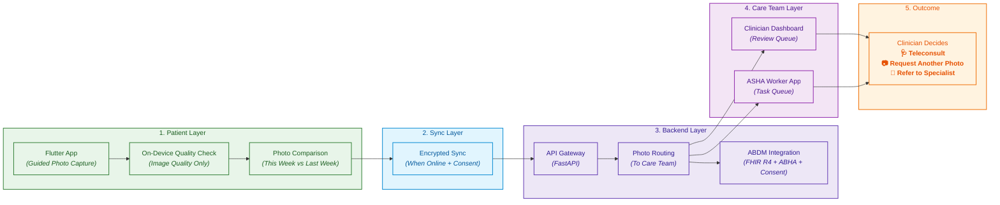

# StepGuard AI — Weekly Foot Check Companion

> **Helping diabetic patients stay connected to their care team — one weekly photo at a time.**

StepGuard AI is a **care coordination and communication tool** for diabetic foot health. It helps patients (or ASHA workers on their behalf) capture a weekly foot photo, shares those photos securely with the patient's care team through ABDM, and keeps the clinician in control of every decision.

**StepGuard AI does NOT diagnose, score risk, recommend treatment, or provide clinical advice.** It is an assistive coordination tool. Every clinical decision is made by a licensed clinician.

[](LICENSE)
[](https://python.org)
[](https://flutter.dev)
[](https://nextjs.org)
[](docs/regulatory/abdm-integration.md)

---

## The Problem

Diabetic foot ulcers precede approximately **85% of lower extremity amputations**, and most are preventable when changes are caught early. But the current care model depends on two things that rarely happen: patients checking their feet regularly, and doctors seeing them frequently enough to notice early changes.

**Why patients struggle to check their feet:**

- **Neuropathy reduces sensation.** Many diabetic patients cannot feel small injuries, blisters, or pressure points. By the time something is visible, tissue damage may already be advanced.
- **Vision and mobility barriers.** Elderly patients, those with visual impairment, or those with limited mobility often cannot inspect the soles of their own feet.
- **Care fatigue.** Managing diabetes already requires constant vigilance. Adding daily foot exams creates fatigue and avoidance.

**Why the healthcare system struggles:**

- **Episodic care is too infrequent.** Patients typically see their doctor every 3–6 months. Changes can develop within weeks.
- **Rural access gap in India.** Diabetes prevalence is rising in India, while specialist foot care remains concentrated in cities. In a Thai study, patients traveled 1–40 km for wound care, costing ~$10 per visit — unsustainable for frequent monitoring.
- **Scale problem.** In India, **two-thirds of patients attending routine diabetes outpatient services are at risk for foot complications**, and **9% already have a prevalent ulcer**. No specialist-led model can reach this population alone.

**The gap is not clinical knowledge. It is communication, continuity, and coordination** between patients, ASHA workers, and clinicians between visits.

---

## The Solution

StepGuard AI is a **weekly foot check companion**. It helps patients and their care teams stay in touch about foot health between clinic visits.

It does this through **four assistive components**:

1. **Guided Photo Capture** — A smartphone app helps patients (or ASHA workers) capture a consistent weekly foot photo with proper lighting and framing.
2. **Image Quality Check** — On-device checks confirm the photo is usable before it is saved or shared.
3. **Week-over-Week Comparison** — The app shows the patient the current photo next to last week's photo, so they can see changes for themselves.
4. **Secure Sharing via ABDM** — Photos are shared with the patient's care team using ABDM's consent framework. Clinicians review the photos and decide what to do next.

**Every clinical decision — whether to schedule a teleconsult, request another photo, or refer to a specialist — is made by a clinician.** StepGuard AI only organizes information and helps people communicate.

### Why This Works

- **Telemedicine for diabetic foot care is well-supported.** A randomized controlled trial in rural Australia found **no statistically significant difference** in wound healing (32% vs. 28%) or amputation rates (23% vs. 25%) between nurse-led telemedicine and usual podiatrist care over 12 weeks. This supports the remote monitoring + escalation model — where the clinician decides.
- **ASHA worker programs already exist and work.** WDF-funded programs in Karnataka, Orissa, and Tripura have trained ASHA workers in diabetic foot screening, reaching hundreds of thousands of patients.
- **ABDM provides the infrastructure.** ABHA identity, FHIR R4 data exchange, consent management, and Fidelius encryption are all production-ready in India.

### Why Now (India-Specific Opportunity)

- **ABDM** provides sandbox and integration toolkits for health tech developers.
- **DPDP Act 2023** provides a clear data protection framework.
- **ASHA workers** are already deployed for diabetic foot screening in multiple states.
- **eSanjeevani** provides a national telemedicine platform with ABDM integration.

---

## System Architecture



---

## Detailed Explanation of Each Component

### 1. Patient Layer

The patient (or ASHA worker) uses a Flutter app to capture a weekly foot photo.

- **Flutter App** — Cross-platform mobile app with guided camera capture (foot outline overlay, lighting check, framing guidance). Supports Hindi + English + regional languages.
- **On-Device Quality Check** — OpenCV-based checks confirm the image is sharp, well-lit, and the foot is fully in frame. No clinical analysis is performed on-device.
- **Photo Comparison** — The app shows the patient the current photo side-by-side with last week's photo. This is a visual reference for the patient, not a clinical interpretation.

*Role:* Help patients and ASHA workers capture consistent weekly photos and see changes for themselves.

### 2. Sync Layer

Since rural India has intermittent connectivity, the app is **offline-first**.

- **Local Storage** — Encrypted SQLite stores photos locally until the patient consents to share.
- **Encrypted Sync** — When connectivity returns and the patient has consented, photos sync to the backend over HTTPS (TLS 1.3).
- **Data Minimization** — Patients can choose to share all photos or only specific ones. Nothing is shared without consent.

*Role:* Respect patient consent and connectivity realities.

### 3. Backend Layer

FastAPI microservices handle ingestion, routing, and ABDM integration.

- **API Gateway** — Nginx + FastAPI routes requests, validates JWT + ABHA tokens, enforces rate limits.
- **Photo Routing** — Routes photos to the correct clinician based on the patient's registered care team.
- **ABDM Integration** — Packages photos into FHIR R4 resources (Observation, DiagnosticReport) for exchange. Handles ABHA identity, consent artifacts, and Fidelius encryption.

*Role:* Move photos securely from patient to care team via India's national health infrastructure.

### 4. Care Team Layer

Two interfaces, both built for humans making decisions.

- **Clinician Dashboard** (Next.js + React) — Review queue with real-time WebSocket updates. Shows the current photo, the previous photo, and the patient's history. Action buttons: **Schedule teleconsult / Request another photo / Refer to specialist / Add note**.
- **ASHA Worker App** (Flutter) — Task queue in Hindi + English. Shows patients due for a weekly photo visit. Includes offline maps, guided capture, and one-tap call to PHC.

*Role:* Enable clinicians to review photos and decide next steps; enable ASHA workers to act in the field.

### 5. Outcome

Success is measured by clinician-decided outcomes and patient engagement:

- **% of weekly photos captured** (patient/ASHA engagement)
- **% of photos reviewed by clinician within 48 hours** (care team responsiveness)
- **% of reviewed cases where clinician scheduled a follow-up** (escalation rate)
- **% reduction in time-to-clinician-review** (vs. routine visits)
- **Patient-reported satisfaction with the weekly check-in**

Benchmarked against baseline (routine visits every 3–6 months, no weekly photo monitoring).

---

## What's Novel Here vs. Existing Work

This project builds on well-established foundations:

- **Telemedicine for diabetic foot care** — RCT-proven equivalent to in-person care in rural settings.
- **ASHA worker programs** — WDF-funded projects in Karnataka, Orissa, and Tripura with proven training models.
- **ABDM infrastructure** — ABHA, FHIR R4, consent management, and Fidelius encryption.
- **Guided photo capture** — Standard mobile UI pattern.

**Key Contribution:** An **end-to-end, ABDM-native coordination tool** that:

1. Lets patients (or ASHA workers) capture weekly foot photos easily.
2. Shares photos securely with the care team using ABDM's consent framework.
3. Keeps the clinician in control of every clinical decision.
4. Works offline-first for rural India.

No existing open-source project combines these four elements into a single working prototype.

---

## Tech Stack

| Layer | Component | Technology |
|-------|-----------|------------|
| **Mobile Apps** | Patient / ASHA / Caregiver | Flutter 3.24 (Dart) |
| **Clinician Portal** | Web dashboard | Next.js 16 + React 19 + TypeScript |
| **UI Components** | Dashboard UI | shadcn/ui + Radix + Tailwind CSS |
| **Charts** | Photo timeline | Recharts |
| **Image Viewer** | Photo viewer | Standard web image + comparison |
| **On-Device** | Image quality check | OpenCV Mobile |
| **Local Storage** | Offline DB | SQLite (AES-256 encrypted) |
| **Backend API** | Microservices | FastAPI (Python 3.12) |
| **ORM** | Database access | SQLAlchemy 2.0 |
| **Validation** | Schema validation | Pydantic 2.9 |
| **Primary DB** | Relational data | PostgreSQL 16 |
| **Cache** | Sessions + queues | Redis 7 |
| **Image Storage** | Photo storage | S3 / MinIO (encrypted) |
| **Message Queue** | Async events | RabbitMQ / Kafka |
| **Task Queue** | Background jobs | Celery + Redis |
| **ABDM SDK** | National health ID | abdm-sdk-node / ABDM-Wrapper |
| **FHIR** | Health data standard | HL7 FHIR R4 |
| **Encryption** | ABDM data exchange | Fidelius (X25519 + AES-GCM) |
| **Telemedicine** | Video consults | eSanjeevani / Zoom Video SDK |
| **Notifications** | Push + SMS | FCM + SMS gateway |
| **Real-time** | Dashboard updates | WebSocket (Socket.io) |
| **Auth** | Identity | OAuth 2.0 + ABHA + JWT |
| **CI/CD** | Build + deploy | GitHub Actions |
| **Container** | Packaging | Docker + Kubernetes |
| **Monitoring** | Metrics | Prometheus + Grafana |
| **Logging** | Audit trails | ELK Stack |

---

## Project Structure

```
stepguard-ai/
├── apps/                              → All client applications
│   ├── patient-app/                   → Flutter patient mobile app
│   ├── asha-app/                      → Flutter ASHA worker app
│   ├── caregiver-app/                 → Flutter caregiver app
│   └── clinician-portal/              → Next.js clinician dashboard
│
├── services/                          → Backend microservices
│   ├── api-gateway/                   → Nginx + FastAPI gateway
│   ├── auth-service/                  → JWT + ABHA auth
│   ├── patient-service/               → Patient CRUD
│   ├── photo-service/                 → Photo ingestion + routing
│   ├── notification-service/          → Multi-channel notify
│   ├── asha-task-service/             → ASHA task queue
│   ├── teleconsult-service/           → Video sessions
│   ├── fhir-converter/                → FHIR R4 conversion
│   └── referral-service/              → Hospital referrals
│
├── integrations/                      → External integrations
│   ├── abdm/                          → ABDM gateway (ABHA + FHIR)
│   ├── esanjeevani/                   → Telemedicine
│   ├── hospital-emr/                  → HL7 / FHIR EMR connectors
│   └── sms-gateway/                   → SMS / IVR providers
│
├── infrastructure/                    → Infrastructure as code
│   ├── terraform/                     → Cloud provisioning
│   ├── kubernetes/                    → K8s manifests
│   ├── docker/                        → Dockerfiles
│   └── monitoring/                    → Prometheus + Grafana
│
├── shared/                            → Shared libraries
│   ├── python/                        → Python shared code
│   ├── dart/                          → Dart shared code
│   └── typescript/                    → TypeScript shared code
│
├── docs/                              → Documentation
│   ├── architecture/                  → System architecture
│   ├── api/                           → API docs
│   ├── clinical/                      → Care coordination protocols
│   ├── regulatory/                    → ABDM + DPDP compliance
│   ├── deployment/                    → Deployment guides
│   └── user-guides/                   → User manuals
│
├── tests/                             → Test suites
│   ├── unit/                          → Unit tests
│   ├── integration/                   → Integration tests
│   ├── e2e/                           → End-to-end tests
│   └── security/                      → Security testing
│
├── scripts/                           → Utility scripts
├── .github/workflows/                 → CI/CD pipelines
├── docker-compose.yml                 → Local dev orchestration
├── requirements.txt                   → Python dependencies
├── Makefile                           → Common commands
├── LICENSE                            → MIT License
└── README.md                          → This file
```

---

## Setup & Installation

### Prerequisites

- **Python** 3.12+
- **Node.js** 22+
- **Flutter** 3.24+
- **Docker** 24+
- **PostgreSQL** 16
- **Redis** 7
- **Android Studio** (for Android SDK, one-time)
- **Xcode** (for iOS, macOS only, one-time)

### Local Development Setup

```bash
# 1. Clone the repository
git clone https://github.com/kamblepranjali88-code/StepGuard-Weekly-Foot-Scan.git
cd StepGuard-Weekly-Foot-Scan

# 2. Copy environment variables
cp .env.example .env

# 3. Start infrastructure (PostgreSQL, Redis, RabbitMQ)
docker-compose up -d postgres redis rabbitmq

# 4. Setup Python environment
python -m venv .venv
source .venv/bin/activate  # On Windows: .venv\Scripts\activate
pip install -r requirements.txt

# 5. Run database migrations
make migrate

# 6. Start backend services
make dev-backend

# 7. Start clinician portal (in another terminal)
cd apps/clinician-portal
npm install
npm run dev

# 8. Start Flutter app (in another terminal)
cd apps/patient-app
flutter pub get
flutter run
```

### Access Points

| Service | URL |
|---------|-----|
| Clinician Portal | http://localhost:3000 |
| API Gateway | http://localhost:8000 |
| API Docs (Swagger) | http://localhost:8000/docs |
| Grafana | http://localhost:3001 |
| RabbitMQ Management | http://localhost:15672 |

---

## Usage

### 1. Run the Patient App

```bash
cd apps/patient-app
flutter run
```

Then:
1. Complete onboarding (link ABHA ID)
2. Tap "Start Weekly Foot Check"
3. Follow guided camera capture
4. Review the photo — see it side-by-side with last week's
5. Choose whether to share with your care team

### 2. Run the Clinician Dashboard

```bash
cd apps/clinician-portal
npm run dev
```

Then:
1. Login with clinician credentials
2. View the review queue
3. Click any case to see the current photo, previous photo, and patient history
4. Take action: **Schedule teleconsult / Request another photo / Refer to specialist / Add note**

### 3. Run the ASHA Worker App

```bash
cd apps/asha-app
flutter run
```

Then:
1. Login with ASHA credentials
2. View "Today's list" (आज की सूची)
3. Tap patient to start assisted photo capture
4. Follow guided capture
5. Help patient consent to share with care team

### 4. Run Tests

```bash
# Python tests
pytest tests/ -v --cov=services

# Flutter tests
cd apps/patient-app && flutter test

# Portal tests
cd apps/clinician-portal && npm test
```

---

## ABDM Integration

StepGuard AI is **ABDM-native**:

- **ABHA** — Patient identity (link photos to national health ID)
- **HFR** — Facility registry (verified hospitals)
- **HPR** — Professional registry (verified clinicians)
- **FHIR R4** — Data exchange standard (Observation, DiagnosticReport, ReferralRequest)
- **Fidelius** — End-to-end encryption (X25519 + AES-GCM)
- **Consent Manager** — Blockchain-based consent artifacts

### Sandbox Setup

```bash
cd integrations/abdm
cp .env.sandbox.example .env
python -m pytest tests/ -v
```

📖 **[ABDM Integration Guide →](integrations/abdm/README.md)**

---

## Regulatory & Compliance

StepGuard AI is designed as an **assistive care coordination tool**, not a diagnostic device. It is compatible with:

| Standard | Status |
|----------|--------|
| DPDP Act 2023 | ✅ Compliant |
| ABDM Integration | ✅ Sandbox Tested |
| FHIR R4 | ✅ Implemented |
| IEC 62304 (reference) | ✅ Architecture Aligned |

**Note:** Clinical use requires review by a licensed clinician. StepGuard AI does not diagnose, score risk, recommend treatment, or provide clinical advice.

---

## Expected Outcome

A working end-to-end prototype demonstrated in three scenarios:

### Scenario 1: Baseline (No Weekly Monitoring)
- Patient visits doctor every 3–6 months
- Changes noticed only during scheduled visits
- Delayed communication between visits

### Scenario 2: StepGuard AI (Patient Self-Capture)
- Patient captures a weekly foot photo on their own smartphone
- Photo is shared with the care team (with consent)
- Clinician reviews within 48 hours and decides next step

### Scenario 3: StepGuard AI (ASHA-Assisted)
- ASHA worker captures a weekly photo for elderly/non-smartphone patients
- Photo is shared with the care team (with consent)
- Clinician reviews and coordinates next step (teleconsult, PHC visit, or specialist referral)

### Headline Metrics

- **% of weekly photos captured** (engagement)
- **% of photos reviewed by clinician within 48 hours** (responsiveness)
- **% of reviewed cases where clinician scheduled a follow-up** (escalation)
- **% reduction in time-to-clinician-review** (vs. baseline)
- **Patient-reported satisfaction** with the weekly check-in

---

## Contributing

We welcome contributions from clinicians, Flutter developers, backend engineers, and public health experts.

- **Read:** [CONTRIBUTING.md](CONTRIBUTING.md)
- **Code of Conduct:** [CODE_OF_CONDUCT.md](CODE_OF_CONDUCT.md)
- **Security Policy:** [SECURITY.md](SECURITY.md)

---

## License

MIT License — see [LICENSE](LICENSE) for details.

Copyright (c) 2026 **Pranjali Kamble**

**Note:** This is an assistive coordination tool. Clinical use requires review by a licensed clinician. StepGuard AI does not diagnose, score risk, recommend treatment, or provide clinical advice.

---

## Acknowledgments

- **World Diabetes Foundation** — ASHA training program models
- **ABDM Team** — Sandbox and integration support
- **All ASHA workers** — The human bridge that makes this work
- **Telemedicine RCT (rural Australia)** — Evidence for remote care coordination

---

## Contact

| Purpose | Contact |
|---------|---------|
| General | hello@stepguard.in |
| Clinical | clinical@stepguard.in |
| Security | security@stepguard.in |

---

**Built with ❤️ for the 100 million+ diabetics in India who deserve to keep their feet.**

**StepGuard AI — Every Step Matters.**
